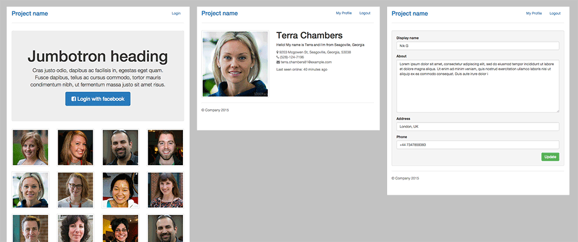
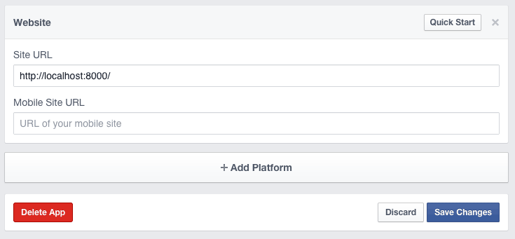

Social Network Starter Kit
==========================


Django app designed to help bootstrapping a social networking website.


- Custom User Model
- Facebook Login
- Image resizing with ImageKit
- Basic Profile Views
- Bootstrap 3


## Getting Started

### Installation

- Add **http://localhost:8000** as Site URL in your Facebook App settings 



- Add your Facebook App credentials to **settings/base.py**

```
SOCIAL_AUTH_FACEBOOK_KEY = '********************'
SOCIAL_AUTH_FACEBOOK_SECRET = '********************'
```
- Install requirements

```
pip install -r requirements.txt
```
- Run migrations

```
./manage.py migrate
```

- Start dev server

```
./manage.py runserver localhost:8000
```


## 3rd Party Apps/Libraries/Plugins 
* Twitter Bootstrap 3 [http://getbootstrap.com](http://getbootstrap.com)
* Python Social Auth [http://psa.matiasaguirre.net](http://psa.matiasaguirre.net)
* ImageKit [http://django-imagekit.readthedocs.org/en/latest/](http://django-imagekit.readthedocs.org/en/latest/)
* Django Braces [http://django-braces.readthedocs.org/en/latest/index.html](http://django-braces.readthedocs.org/en/latest/index.html)
* Django Bootstrap Form [https://github.com/tzangms/django-bootstrap-form](https://github.com/tzangms/django-bootstrap-form)
* Random User Generator [https://randomuser.me/](https://randomuser.me/)
